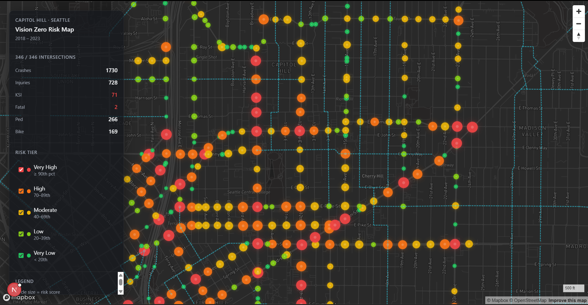
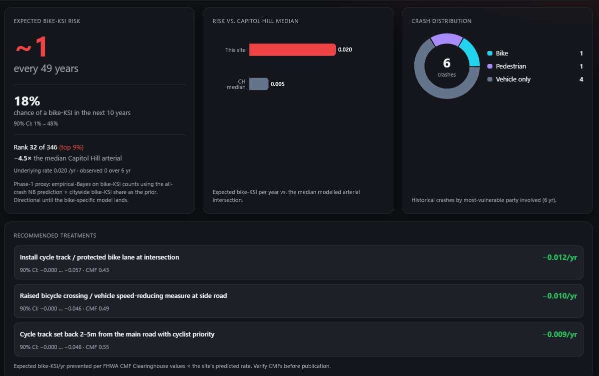
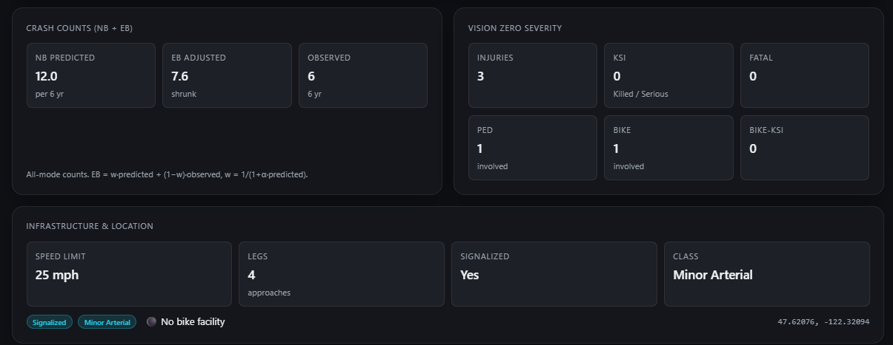

# Intersection Risk Model: Capitol Hill, Seattle

An interactive map and statistical model that scores Capitol Hill's intersections by bike crash risk and tells you, per intersection, which engineering fixes the evidence supports.

Built on Seattle's own crash records (SDOT, 2018 to 2023) and the AASHTO Highway Safety Manual methodology that state DOTs use to prioritize safety projects.

## See it in action

### 1. Map overview


### 2. Vision Zero scorecard


### 3. Drill in panel


## What this project is, in plain English

Seattle has a Vision Zero commitment: eliminate traffic deaths and serious injuries. Across the 346 arterial intersections this model covers, Capitol Hill recorded 1,720 crashes from 2018 to 2023, and 16 of them left a cyclist killed or seriously injured ("KSI"). With limited budget for safety upgrades, the question becomes: which intersections deserve attention first, and what should we actually build there?

This project answers both:

1. **Risk score per intersection.** Three statistical models (the same family the U.S. Highway Safety Manual recommends) read each intersection's features: signalization, number of approaches, presence of a bike facility, arterial class, posted speed, and an exposure measure. One model each for bike, pedestrian, and motor-vehicle-only crashes. The pipeline then converts each mode's prediction into an expected KSI rate per year with an uncertainty range.
2. **Recommended fixes per intersection.** For each site, the app filters the FHWA's Crash Modification Factor (CMF) Clearinghouse, a peer reviewed catalog of before and after safety studies. It finds the treatments that apply, ranks them by predicted bike KSI prevented, and shows the top three.

A FastAPI backend serves the scored intersections. A Next.js and Mapbox frontend lets you explore them visually.

## At a glance

| | |
|---|---|
| **Scope** | 346 arterial intersections in Capitol Hill, Seattle (of 651 built; local-access streets are excluded from the model) |
| **Crash window** | 6 years, 2018 to 2023 |
| **Crashes observed** | 1,720 total at modelled sites: 169 bike, 266 pedestrian, 1,295 vehicle-only, 16 bike KSI |
| **Model family** | Negative Binomial (NB2) regression, HSM Chapter 12 Safety Performance Function |
| **Models fit** | Three, one per crash mode (`nb_v3_bike`, `nb_v3_ped`, `nb_v3_vehicle`) |
| **Calibration vs. observed** | bike −1.4%, ped +0.7%, vehicle −0.9% (HSM threshold ±15%) |
| **Treatment library** | 11 curated CMFs from FHWA Clearinghouse, 2025-11-10 export (8 bike, 1 ped, 2 vehicle) |
| **Stack** | Python, statsmodels, FastAPI, Next.js, Mapbox |

## Quick start

The stack is two services: a FastAPI backend (port 8000) and a Next.js frontend (port 3000). Pipeline outputs are already committed to `data/`, so you can run the app on a fresh clone without re-running the model.

### 1. Backend (Python ≥ 3.10)

```sh
pip install -r requirements.txt
uvicorn api_server:app --port 8000 --reload
```

### 2. Frontend (Node 18+)

```sh
cd frontend
npm install
cp .env.local.example .env.local      
npm run dev
```

Paste your Mapbox public token into `.env.local`, then open <http://localhost:3000>.

### 3. (Optional) Rebuild the model from scratch

```sh
python seattle_arcgis.py                
python -m pipeline.build_intersections  
python -m pipeline.snap_crashes         
python -m pipeline.assemble_features    
python -m pipeline.fit_risk_model       
python -m pipeline.score_risk           
```

> Windows note: prefix each script with `python -X utf8` to avoid `cp1252` encoding errors on Unicode print statements.

## What you see in the app

* **Vision Zero scorecard** at the top of the page: total crashes, injuries, KSI, fatalities, and ped and bike involvement, recomputed live whenever you filter the map.
* **Interactive map** of the 346 modelled arterial intersections, colored by `risk_tier` and sized by `risk_score`. Hover for a tooltip, click for the full drill in. (The pipeline builds 651 intersections from the street network, but the API inner-joins on scores, so it serves only the sites the model actually fit.)
* **Layer toggles** for tier filtering and a bike facilities overlay.
* **Drill in panel** for any clicked intersection:
  * Score badge (`very_high` to `very_low`)
  * Expected vs. actual crash counts over the 6 year window
  * Severity breakdown (injury, KSI, fatal, ped, bike)
  * Top contributors: the three features pushing this intersection farthest from the modelled baseline, each labeled `+X%` or `−X%`
  * Recommended treatments: top 3 CMF supported fixes, with predicted bike KSI prevented per year

## How the model works

<details>
<summary><b>The dataset</b></summary>

Every numeric input comes from official Seattle GIS layers, downloaded by `seattle_arcgis.py` from the city's ArcGIS portal:

* **Intersections** derived by clustering street segment endpoints in `pipeline/build_intersections.py`
* **Crashes** from SDOT's collision dataset, snapped within 25 m of each intersection (`pipeline/snap_crashes.py`)
* **Severity and mode counts** per intersection, derived from SDOT's `MAXSEVERITYCODE`:
  * `injury_total`: any injury (code ≥ 2)
  * `ksi_total`: Killed or Seriously Injured (code ≥ 3, the Vision Zero target)
  * `fatal_total`: fatal only (code = 4)
  * `ped_total` / `bike_total`: crashes with `PEDCOUNT > 0` or `PEDCYLCOUNT > 0`
  * `vehicle_only_total`: crashes involving neither a pedestrian nor a cyclist
  * `bike_ksi_total` / `ped_ksi_total` / `vehicle_only_ksi_total`: the KSI subset of each mode
* **Features** signalization, leg count, posted speed, bike facility presence, arterial class, AADT (annual weekday daily traffic), and `bike_centrality` (OSM bike-network betweenness, the cyclist exposure proxy)

Caveat: SDOT's per crash `PEDCOUNT` and `PEDCYLCOUNT` fields are sparse for records after 2018, so `snap_crashes.py` falls back to keyword matching on `SDOT_COLDESC` to recover the gap.

</details>

<details>
<summary><b>The statistical model</b></summary>

* **Family:** statsmodels `NegativeBinomial` (NB2), log link, `offset = log(years_observed)` over the 6 year window.
* **Scope:** arterial intersections only (`arterial_class >= 1` with positive AADT). The model excludes local access streets, following HSM Chapter 12 facility type stratification. They are 63% zero crash, contribute only 1 of the 17 bike KSI events citywide, and would force one coefficient set to describe two physically different facility classes. The pipeline builds 651 intersections, then drops 286 as non-arterial and 19 for missing AADT, leaving **346** in the fit. (This is why two bike-KSI counts appear in this repo: **17** across all 651 intersections, **16** across the 346 the model actually fits. Model figures use 16.)
* **Three models, one per crash mode.** They share a predictor block so coefficients are directly comparable across modes; only the exposure term differs.

  ```
  bike_total          ~ SHARED + log_bike_centrality
  ped_total           ~ SHARED + log_aadt
  vehicle_only_total  ~ SHARED + log_aadt

  SHARED = is_signalized + C(legs_cat, Treatment(reference=4))
         + max_speed_limit + bike_facility + C(arterial_class)
  ```

  Each fit carries `offset = log(years_observed)` and lands in `data/model/nb_v3_{mode}.pkl`.

* **Leg count is a top-coded categorical, not a continuous slope.** `legs_cat` collapses 5-or-more legs into one category, with 4 legs as the reference. This is the one modelling choice here with decisive measured support: a nested likelihood-ratio test rejects the continuous slope in all three modes (p = 0.0088 / 9.0e-08 / 1.5e-07) while never rejecting the top-coding (p = 0.63 / 0.70 / 0.81). See [`pipeline/feature_encoding.py`](pipeline/feature_encoding.py) and experiment [E5](EXPERIMENTS.md).
* **Why the bike model uses centrality instead of AADT.** AADT measures motor-vehicle volume, which is the wrong exposure denominator for cyclists. `bike_centrality` is a betweenness-centrality score over the OSM bike network ([`pipeline/build_bike_exposure.py`](pipeline/build_bike_exposure.py)), used as a proxy for cyclist exposure. **In testing it does not work.** The coefficient never reaches significance (p=0.369), and AADT fails just as badly in its place (experiment [E3](EXPERIMENTS.md)). The bike model effectively has no working exposure term. This is the project's most important open problem, and it needs real cyclist counts rather than a different proxy.
* **Empirical Bayes adjustment** (HSM Part C): `w = 1 / (1 + α·μ); eb = w·μ + (1−w)·N`, applied per mode with that mode's own α. Pulls extreme model predictions toward observed counts at sites with enough data.
* **Headline metric served to the UI:** `expected_bike_ksi_per_year` with a 90% credible interval. Derived by applying a Poisson Gamma direct EB to bike KSI counts, using the **bike-crash** NB prediction × the citywide bike KSI share (16/169 = 9.5%) as the prior.
* **Secondary fields:** `risk_score` (0 to 100 percentile rank) and `risk_tier` (`very_high` ≥ 90, `high` 70 to 89, `moderate` 40 to 69, `low` 20 to 39, `very_low` < 20), used for sorting and map color. These currently rank on bike KSI. The pipeline also computes `all_mode_percentile` (the composite), but does not yet surface it as the headline.

</details>

<details>
<summary><b>From crash counts to bike KSI: the full chain</b></summary>

The model predicts crash *counts*. The app reports *KSI risk*. Four steps connect them, all in [`pipeline/score_risk.py`](pipeline/score_risk.py):

1. **NB prediction.** `nb_v3_bike` gives expected bike crashes per site over 6 years.
2. **EB shrinkage on the crash count.** `w = 1/(1 + α·μ)`, `eb = w·μ + (1−w)·N`. Emitted as `bike_eb_count`.
3. **KSI prior.** `μ_KSI = bike_expected_total × 9.5%`, the citywide share of bike crashes that are KSI. Note this step consumes the **raw** NB prediction, not the EB-shrunk count from step 2.
4. **Poisson-Gamma EB on the KSI count.** Posterior `Gamma(k + N_KSI, μ_KSI/(k + μ_KSI))` with `k = 1/α`, giving a mean and 90% credible interval. Divided by 6 for the per-year headline.

Ped and vehicle KSI follow the identical chain with their own α and share (12.0% and 1.9%). The composite `all_ksi_per_year` sums the three posteriors, which overstates by roughly 2.8% because a few crashes are flagged as both bike and ped.

Why KSI is not modelled directly: there are only 16 bike, 32 ped, and 25 vehicle-only KSI events. With 11 predictors plus α, all three sit far below the ~10-events-per-parameter rule of thumb for stable NB maximum likelihood. The severity-share step is the standard workaround, and it is the single largest source of modelling risk in the project.

</details>

<details>
<summary><b>Why <code>log(AADT)</code> instead of raw <code>AADT</code></b></summary>

This is a functional form choice, not a scaling trick. With a log link GLM:

* **Raw AADT** gives `μ ∝ exp(β · AADT)`. Crashes then grow exponentially with volume, which is not physical.
* **log(AADT)** gives `μ ∝ AADT^β`. Crashes follow a power law. With β < 1 you recover the well documented sub linear "safety in numbers" effect: doubling volume multiplies crashes by `2^β`, not 2.

At our fitted `β ≈ 0.22` (0.223 ped, 0.226 vehicle), doubling AADT multiplies expected crashes by `2^0.226 ≈ 1.17` (a 17% increase, not 100%). Drivers slow down in denser traffic, cyclists adjust routes, pedestrian behavior shifts. Per vehicle risk drops as volume rises.

AASHTO HSM SPFs take exactly this shape: `μ = exp(β₀) · AADT_major^β₁ · AADT_minor^β₂ · CMFs · years`. Taking log of both sides yields our linear predictor with `log(AADT)` as the term. Every state DOT SPF in active use is the same shape.

**We tested this, and the theory survives while the marketing does not** (experiment [E1](EXPERIMENTS.md)). Fitting raw, sqrt, log and no-volume specs head to head:

* **The four specs are statistically indistinguishable out of sample.** Total MAE spread is 0.4% (ped) and 0.06% (vehicle) against a fold SD of ~0.08, and the vehicle ranking *inverts* depending on the CV seed. This dataset cannot tell them apart.
* **An earlier version of this README claimed raw AADT would give "astronomical" predictions at 50,000 AADT. That claim was wrong.** Raw predicts 7.08 vehicle crashes there against log's 4.76, a factor of 1.49, not a blow-up.
* **More to the point, observed AADT runs 1,013 to 41,808.** There are zero sites above 50,000 and exactly one above 30,000. The old argument reasoned from a volume regime this dataset never observes.
* `log_aadt` is **not significant for pedestrians** (β=0.223, p=0.119); it reaches p=0.034 for vehicles. BIC would drop volume from both.

So log(AADT) stays, on HSM convention and functional-form grounds. Those are good reasons. But we did not keep it because we measured it beating the alternatives. We didn't, and at this sample size we couldn't.

</details>

<details>
<summary><b>Coefficient interpretation (fits <code>nb_v3_bike</code> / <code>nb_v3_ped</code> / <code>nb_v3_vehicle</code>)</b></summary>

Each `β` is on the log rate scale; `exp(β)` is the multiplicative effect on the expected crash count, all else equal. Because the three models share a predictor block, the columns are directly comparable. Significance markers: `***` p<0.01, `**` p<0.05, `*` p<0.10.

| Term | bike β | ped β | vehicle β | Reading |
|---|---|---|---|---|
| `is_signalized` | +1.009 *** | +1.096 *** | +0.985 *** | ~2.7× across every mode, the most stable effect in the model. Signals sit at the busiest, highest conflict junctions. That is selection, not causation. |
| `legs_cat = 3` (vs 4) | −1.564 *** | −1.707 *** | −1.263 *** | A 3-leg intersection carries roughly a quarter the crashes of a 4-leg one. Fewer conflict points. |
| `legs_cat = 2` (vs 4) | −0.873 * | −0.745 ** | −0.546 ** | Same direction, weaker. |
| `legs_cat = 5+` (vs 4) | +0.104 | −0.366 | +0.263 | Not significant in any mode; the top-coded category is thinly supported. |
| `arterial_class = Minor` | +0.820 *** | +0.557 *** | +0.196 | Strongest for bikes, absent for vehicles. |
| `arterial_class = Collector` | +0.082 | +0.013 | +0.099 | No signal. |
| `arterial_class = Other` | +1.443 | +0.854 | +0.868 ** | Heterogeneous catch-all; high but noisy. |
| `bike_facility` | −0.639 ** | −0.625 *** | −0.306 ** | −47% for bikes. Note it is protective for *all* modes, which suggests it partly proxies for calmer street design rather than a bike-specific effect. |
| `max_speed_limit` | −0.086 | −0.076 | −0.093 * | Suspicious sign in all three. Posted speed has a narrow range here and is a poor proxy for operating speed. |
| `log_aadt` | n/a | +0.223 | +0.226 ** | +17% per AADT doubling (`2^0.226`), sub-linear "safety in numbers". |
| `log_bike_centrality` | +0.141 | n/a | n/a | **Not significant** (p=0.369). See experiment E3. |
| α (NB dispersion) | 1.238 *** | 0.305 ** | 0.659 *** | Significant in all three, so NB is the right family over Poisson. Quantified in experiment E2. |
| Pseudo R² | 0.118 | 0.171 | 0.110 | |

Read with care: these coefficients are associative, not causal. `is_signalized` is not "signalizing causes crashes". `bike_facility`'s −47% blends protected lanes (about −60% in CMFs) with sharrows (about −5%), and its appearance in the vehicle model is a clue that it is not measuring what its name suggests. For genuinely causal treatment effects, see the CMF section below.

</details>

<details>
<summary><b>Calibration and verification</b></summary>

We calibrate and check each mode separately. All figures below are **in-sample**, over the 346 modelled intersections and the full 6 year window.

| Metric | bike | ped | vehicle |
|---|---|---|---|
| Events observed | 169 | 266 | 1,295 |
| Sum predicted | 166.7 | 267.8 | 1,282.8 |
| Calibration gap | −1.4% | +0.7% | −0.9% |
| MAE per intersection | 0.58 | 0.70 | 2.76 |
| RMSE per intersection | 1.05 | 1.05 | 4.29 |
| Spearman ρ (predicted vs. observed crashes) | +0.43 | +0.59 | +0.61 |
| 90% predictive coverage, crash count | 96.5% | 97.1% | 94.8% |
| 90% predictive coverage, KSI proxy | 99.1% | 98.0% | 98.8% |
| α (dispersion) | 1.238 | 0.305 | 0.659 |

All three sit far inside the HSM's ±15% calibration threshold. Coverage runs above the nominal 90% partly because NB predictive quantiles are discrete and step over the target, and partly because the KSI proxy borrows the crash model's α, which is conservative for a rarer event.

The three targets sum to 1,730 rather than the 1,720 `total_crashes` figure, because a small number of crashes are flagged as both bike and ped and therefore appear in two targets. The composite all-mode KSI inherits roughly a 2.8% overstatement from the same source.

**These are in-sample numbers, and in-sample fit is a weak claim.** Out-of-sample cross-validated results, and head-to-head tests of the modelling choices above, are in the experiments section below and in [`EXPERIMENTS.md`](EXPERIMENTS.md).

Run the diagnostics yourself with:

```sh
python -m pipeline.fit_risk_model
python -m pipeline.evaluate_models
```

`evaluate_models.py` adds per-mode coefficient tables with 90% CIs, VIFs, pseudo-R², AIC, log-likelihood ratio tests, top residual sites, a zero-inflation check, and cross-mode residual correlation.

Where the model is weakest: 16 bike KSI events across 346 sites over 6 years is a fundamentally noisy sample. Rank correlation against observed bike KSI is correspondingly imprecise, and the severity-share step (section above) is doing a lot of work. Lifting this requires more data, not a fancier model class: real cyclist exposure (Strava Metro or bike counts), a denser bike-specific target, or expanded geographic scope.

</details>

## What we tested, and what the tests actually showed

Most write-ups present modelling decisions as if they were obviously right. We audited this one, and the audit found the opposite: nearly every choice rested on a *stated justification* with no measured alternative. To fix that, independent agents ran seven A/B experiments, and a further agent reviewed the results without having run any of them.

> **📊 [RESULTS.md](RESULTS.md) is the plain-English version, with charts.** Start there.
> [`EXPERIMENTS.md`](EXPERIMENTS.md) holds the full technical detail, and [`experiments/`](experiments/) holds the scripts and raw outputs.

| # | Question | Result |
|---|---|---|
| [E5](EXPERIMENTS.md) | Leg count: continuous vs top-coded vs full categorical | **Top-coding confirmed.** Continuous slope decisively rejected (p ≤ 0.0088 all modes) |
| [E2](EXPERIMENTS.md) | Negative Binomial vs Poisson | **NB confirmed, on variance only.** Point accuracy is identical (p = 0.48 / 0.26 / 0.83) |
| [E7](EXPERIMENTS.md) | NB vs zero-inflated NB | **Zero-inflation not warranted.** NB already reproduces the zeros (256 observed vs 256.5 predicted) |
| [E6](EXPERIMENTS.md) | Exposure as offset vs free covariate | **Not identifiable here** (exposure ≡ 6 years); offset justified on a synthetic variable-exposure design |
| [E4](EXPERIMENTS.md) | One pooled model vs three per-mode models | **No measurable out-of-sample benefit** from the split (coefficient homogeneity LR p = 0.643) |
| [E1](EXPERIMENTS.md) | log(AADT) vs raw vs sqrt vs none | **Cannot distinguish.** The old README's stated rationale was refuted |
| [E3](EXPERIMENTS.md) | Bike exposure: centrality vs AADT vs both vs neither | **Cannot distinguish.** No exposure term is identifiable at 169 events |

Three findings are worth stating plainly, because they are uncomfortable:

**Accuracy does not justify the three-model architecture.** E4 found that the per-mode split delivers no measurable out-of-sample improvement over one pooled model with a citywide share applied. A pooled model with 12 parameters matches the current 36-parameter version. A likelihood-ratio test finds no coefficient differing significantly across modes (LR = 17.15 on 20 df, p = 0.643). The v2→v3 rewrite *did* improve the model, but the gain came from fixing the leg encoding, not from splitting by mode. **The honest case for keeping three models is interpretability**, meaning per-mode risk reporting and cross-mode coefficient comparison, both of which the app genuinely uses. It is not an accuracy case.

**The bike model has no working exposure term.** Neither centrality nor AADT predicts bike crashes here (E3). The two do not duplicate each other either (r² = 0.06). Both simply carry no information at 169 events across 346 sites.

**This dataset can rule out bad specifications, not choose between good ones.** The decisive results (E5, E2, E6, E7) all reject something clearly wrong. Every comparison between *reasonable* alternatives came back underpowered. Repeated-CV standard deviations in the underlying reports understate uncertainty by 2 to 5 times, because reshuffling folds re-partitions the same fixed 346 sites. Against a correct paired site-level standard error, no E1, E3 or E4 difference separates from zero. Having 346 intersections and 16 bike KSI events causes that limitation, and no modelling choice fixes it.

## From "where is risk?" to "what should we build?": the CMF layer

The model is descriptive. It tells you where crashes happen and what correlates with them, but its coefficients are observational, not causal. To answer "what should we do?", the app uses the canonical HSM Part C two stage method:

```
bike_KSI_prevented_per_year(site, treatment) =
    expected_bike_ksi_per_year(site) × (1 - CMF(treatment))
```

The model supplies the site baseline. Published Crash Modification Factors supply the causal treatment effect multiplier. CMFs come from before and after studies with comparison groups, peer reviewed by FHWA and rated 1 to 5 stars in the [CMF Clearinghouse](https://www.cmfclearinghouse.org/).

[`pipeline/build_cmf_library.py`](pipeline/build_cmf_library.py) ingests a direct Clearinghouse CSV export and filters to approved, intersection related, non rural studies. It applies the crash-type filter **per mode** (bike, ped, vehicle), so the library now covers all three modes the model fits. It aggregates per treatment using variance weighted averaging only when every study reports a standard error; otherwise a simple mean with across study variance. This avoids over weighting whichever paper happened to report SEs.

### Current library (Clearinghouse export 2025-11-10): 11 treatments

**Bike (8)**

| Treatment | Studies | CMF (90% CI) | Direction | Applies when |
|---|---|---|---|---|
| Install cycle track or protected bike lane | 4 | 0.43 (0.14 to 0.71) | helpful | `bike_facility = 0` |
| Raised bicycle crossing | 1 | 0.49 (0.30 to 0.68) | helpful | any |
| Offset cycle track w/ cyclist priority | 1 | 0.55 (0.28 to 0.82) | helpful | `bike_facility = 0` |
| Install painted bike lane | 4 | 0.56 (0.07 to 1.04) | helpful | `bike_facility = 0` |
| Prohibit right turn on red | 8 | 0.58 (0.54 to 0.63) | helpful (prevention) | `is_signalized = 1` |
| Convert yield to signalized | 10 | 1.04 (0.64 to 1.45) | anti indication | `is_signalized = 0` |
| Bike lane at signalized intersection | 8 | 1.08 (0.78 to 1.37) | anti indication | `bike_facility = 0`, `is_signalized = 1` |
| Convert to single lane roundabout | 23 | 1.40 (1.25 to 1.56) | anti indication | any |

**Pedestrian (1)**

| Treatment | Studies | CMF (90% CI) | Direction | Applies when |
|---|---|---|---|---|
| Leading pedestrian interval (signal phasing) | 8 | 0.78 (0.66 to 0.89) | helpful | `is_signalized = 1` |

**Vehicle (2)**

| Treatment | Studies | CMF (90% CI) | Direction | Applies when |
|---|---|---|---|---|
| Road diet (4-lane undivided to 2 lanes + turn lane) | 4 | 0.54 (0.45 to 0.64) | helpful | any |
| Prohibit right turn on red | 16 | 0.92 (0.91 to 0.94) | helpful (prevention) | `is_signalized = 1` |

What the evidence actually says:

* Cycle tracks and raised crossings are the clear winners. Strong, consistent reductions across multiple studies.
* Prohibiting right turn on red has 8 consistent studies showing permitting it raises bike crashes about 77%. Prohibition is recommended with high confidence.
* Roundabouts increase bike crashes by about 40% across 23 studies. This is the well documented bike roundabout paradox. Safer for cars and pedestrians, more dangerous for cyclists due to entry and exit conflict geometry. They appear in the library as an explicit anti indication so planners considering them see the bike specific evidence.
* Bike lanes at signalized intersections show no net effect (CMF about 1.08). The likely explanation is that the facility raises cyclist exposure roughly as much as it reduces per cyclist risk. This is exactly why bike volume data is the next big data acquisition.

### How recommendations rank in the app

[`pipeline/treatments.py`](pipeline/treatments.py): for each intersection, filter to applicable treatments, compute `prevented = prediction × (1 − cmf)`, sort descending, keep top 3. Anti indications naturally sort to the bottom (negative `prevented`). They are shown for informational purposes, not endorsement.

## Repo layout

```
seattle_arcgis.py        ArcGIS REST fetcher for Seattle GIS datasets
api_server.py            FastAPI: /api/intersections, /api/bike-facilities
data/
  cmf_library.json                              Curated CMFs (generated)
  raw/cmf_clearinghouse_2025-11-10.csv          FHWA Clearinghouse export (9,777 CMFs)
  intermediate/                                 Pipeline outputs (intersections, features, scores)
  model/                                        Fitted .pkl models
pipeline/
  build_intersections.py    Street endpoints to clustered intersection points
  snap_crashes.py           Crashes within 25 m to per intersection counts and severity
  assemble_features.py      Per intersection feature matrix
  build_bike_exposure.py    OSM bike network betweenness centrality per intersection
  fit_risk_model.py         Three per-mode NB2 SPF fits and predictions (arterial only)
  score_risk.py             Per-mode EB shrinkage, KSI proxies, 90% CIs, treatments
  feature_encoding.py       Shared predictor encoding (leg top-coding)
  contributors.py           Per intersection top contributors derivation
  treatments.py             Filter applicability and rank per site treatments
  build_cmf_library.py      Re-runnable Clearinghouse CSV to data/cmf_library.json
  counterfactual.py         Predict at hypothetical feature configurations
  evaluate_models.py        Calibration, coverage, rank correlation diagnostics
  tests/                    pytest: EB math, contributors, treatments, calibration
frontend/
  app/                      Next.js app router pages
  components/               Map, IntersectionReport, LeftPanel, MetricPrimitives
  lib/                      Typed API client and shared types
experiments/
  hierarchical_nb_sketch.py   Partial-pooling NB sketch (spec only, not wired in)
  ab/                         A/B experiment scripts (E1-E7)
  results/                    Measured experiment outputs (markdown + JSON)
```

## Project background

This is a portfolio and civic tech project. The aim is to demonstrate the HSM standard methodology, a Safety Performance Function plus CMFs, on real Seattle data, end to end, with an honest accounting of what the model can and cannot say.

Pull requests, issue reports, and suggestions are welcome.
