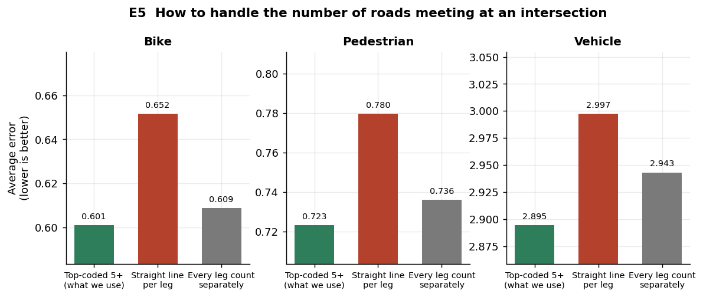
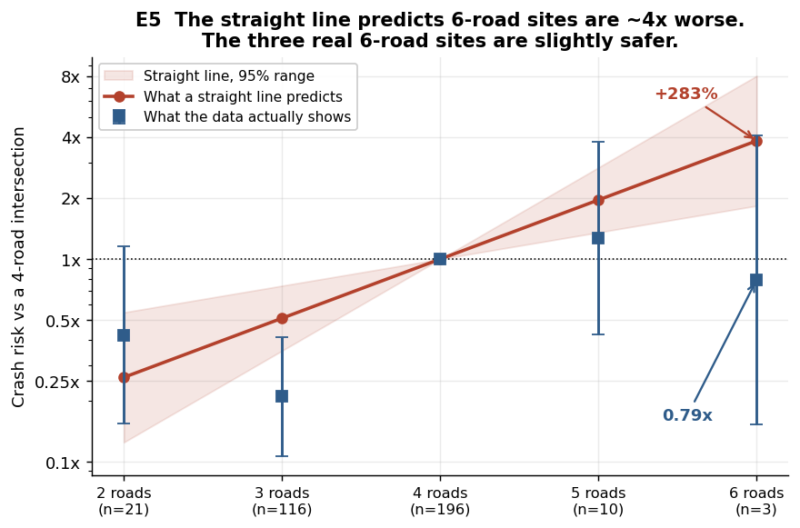
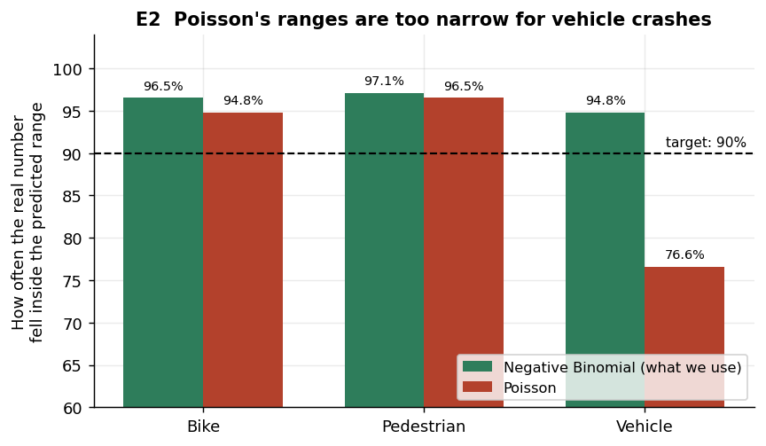
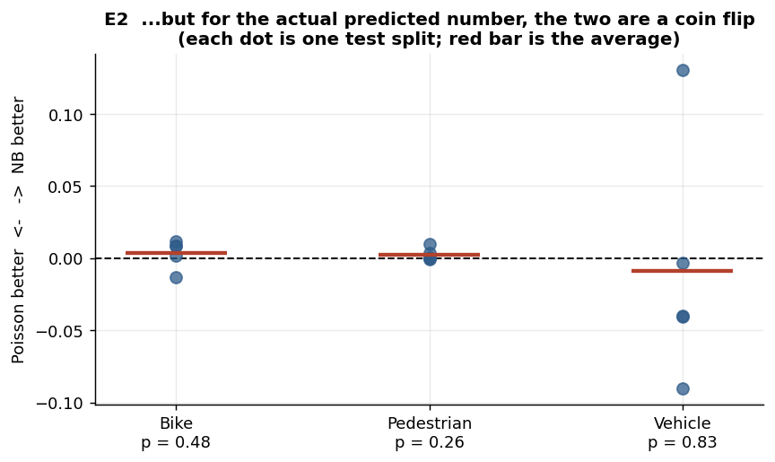
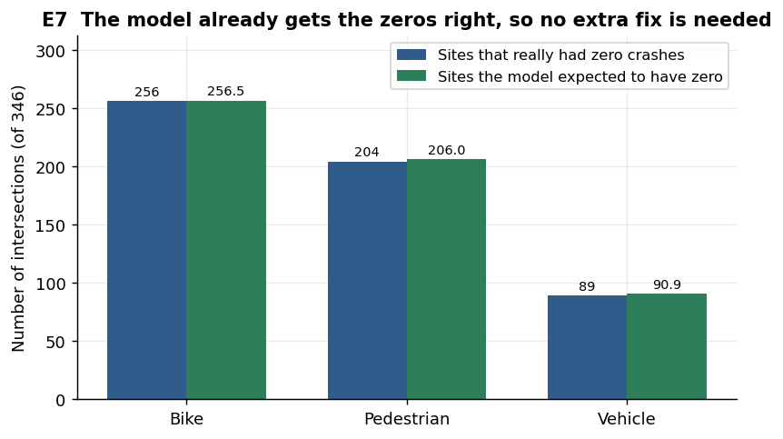
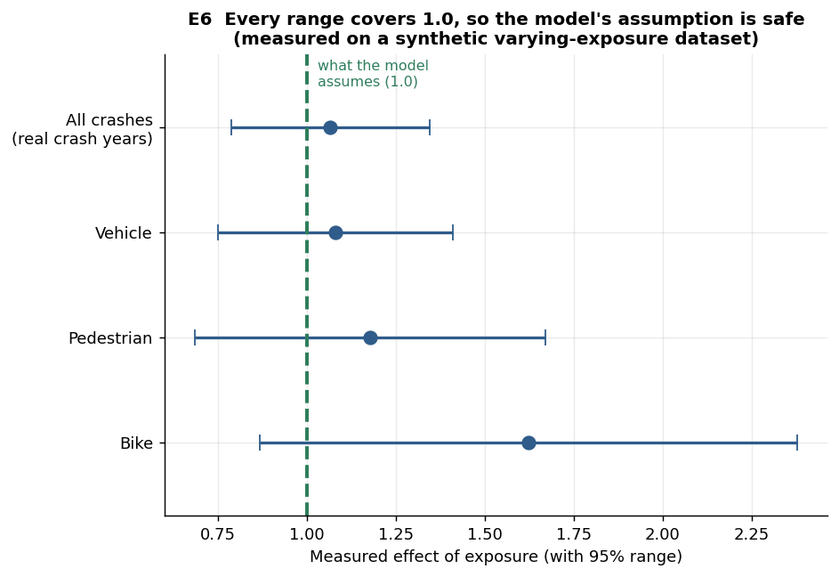
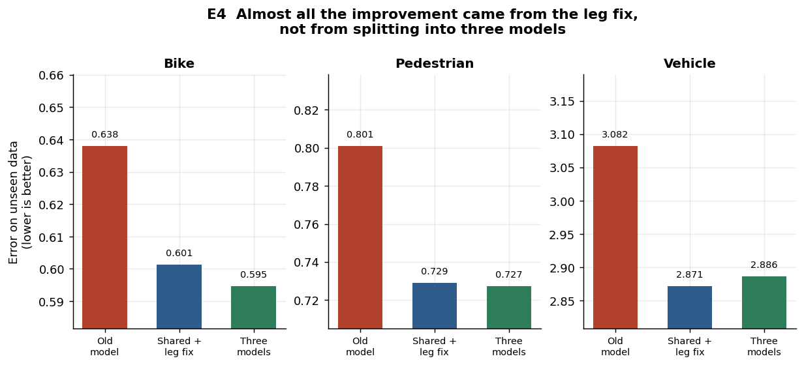
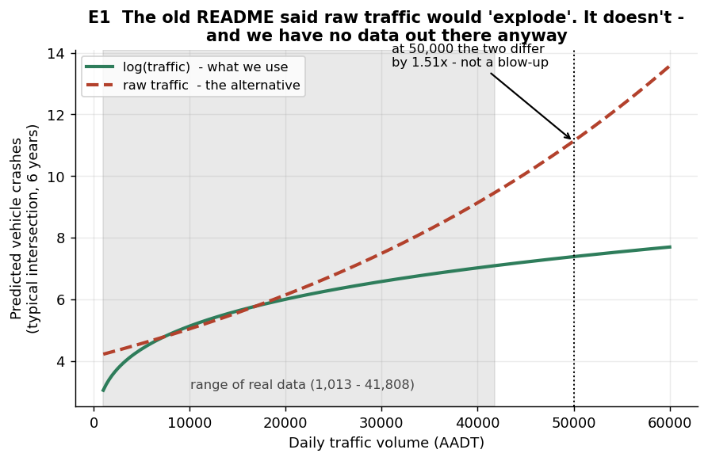

# What we tested, and what we found

This model predicts which intersections in Capitol Hill are most dangerous. Before trusting it, we checked the choices behind it: the kind of choices that usually just get written down as "this is how it's done."

We ran seven tests. Six gave a clear answer. This page shows those six in plain English, with a chart for each.

[EXPERIMENTS.md](EXPERIMENTS.md) holds the full technical detail. The script [`experiments/ab/make_figures.py`](experiments/ab/make_figures.py) generates every chart here by reading the measured results directly, so nobody typed a number in by hand.

**One note on reading the charts.** Several of them zoom in on the vertical axis so you can see the bars at all. That makes small differences look bigger than they are. Where a difference is too small to trust, the text says so.

---

## 1. How we count the roads meeting at an intersection

**The question.** Some intersections have 3 roads meeting, most have 4, a few have 5 or 6. Should the model treat "number of roads" as a simple number that keeps climbing, or as separate categories?

**Why it matters.** If you treat it as a climbing number, the model assumes each extra road adds the same amount of risk. That sounds reasonable, but it forces the model to guess about 6-road intersections from a pattern it learned on 3- and 4-road ones.

**What we found.** Treating them as categories wins clearly, in all three crash types.

This is the strongest result we got. A formal statistical test rejects the climbing-number approach decisively (p = 0.0088, 0.00000009, and 0.00000015 for bike, pedestrian and vehicle crashes). Those very small numbers mean we can be confident the approach is wrong, not just unlucky.

**Here is the interesting part.** A comment in the code claimed the climbing-number approach would predict a 6-road intersection is about **280% more dangerous** than a 4-road one. Nobody had ever saved the calculation. We re-ran it and got **+283%**. The comment was right.

But it gave the wrong reason:

The red line shows what the climbing-number model predicts. The blue squares show what the data actually does. The comment said no 6-road intersections existed to check against. In fact **three** exist, and they come out slightly **safer** than 4-road intersections (0.79x), not four times more dangerous.

The real pattern is not a steady climb at all. **3-road intersections are dramatically safer than 4-road ones**, at roughly one fifth the risk. Drawing a straight line through that steep drop and continuing it upward is what invents the "+283%" figure.

> **Bottom line:** we kept the categories approach. It was the right call, for a better reason than the one originally written down.

---

## 2. Which statistical model family to use

**The question.** Crash counts are whole numbers (0, 1, 2 crashes and so on). Two standard models handle that: **Poisson**, the simpler one, and **Negative Binomial**, which allows more variability. The code assumed Negative Binomial was right but never tested Poisson.

**What we found.** Negative Binomial *is* right, but only for one specific thing, and that distinction is worth stating precisely.

**Where it matters: the uncertainty ranges.** The app shows a range like "we expect 2 to 8 crashes here." That range has to be honest. Poisson's ranges come out far too narrow for vehicle crashes:

A "90% range" should contain the real answer about 90% of the time. Poisson managed only **77%** for vehicle crashes, so 81 intersections out of 346 fell outside a range meant to catch nearly all of them. Negative Binomial reaches 95%.

**Where it does not matter: the actual prediction.** If you only care about the single predicted number, the two models are a coin flip:

Each dot is one test. Some favour one model, some the other, and the averages sit essentially on the zero line (p = 0.48, 0.26, 0.83, nowhere near significant).

> **Bottom line:** Negative Binomial is correct, and it earns that on *uncertainty*, not on the prediction itself. Since this app exists to show honest confidence ranges, that matters a lot.

---

## 3. Do we need a special fix for all the zeros?

**The question.** Most intersections recorded zero bike crashes, 256 out of 346. When data contains that many zeros, statisticians often add a special "zero-inflation" component. Should we?

**What we found.** No. The model already handles the zeros correctly on its own.

The bars nearly match in all three cases. The model expected 256.5 intersections with zero bike crashes, and 256 had none. For pedestrians it expected 206 against 204 actual. For vehicles, 91 against 89.

We fitted the zero-inflation version anyway. Its extra component shrank to essentially nothing (0.0000000000001), and the model came out *worse* by exactly the penalty for carrying a useless part.

> **Bottom line:** no change needed. The obvious worry turned out to be unfounded, and checking it beat assuming it.

---

## 4. How we account for the 6-year time window

**The question.** All crash counts cover 6 years. The model builds that in as a fixed assumption: double the time, double the expected crashes. Should it instead *measure* that relationship from the data?

**What we found first, a genuinely useful dead end.** We cannot test this on the real data. Every intersection carries exactly 6 years of records, so nothing varies for the model to learn from. Trying anyway produces a broken calculation.

Here is the alarming part. **The software does not complain.** It reports success and hands back confident-looking numbers that mean nothing. Nothing in a normal workflow would catch it. That is worth knowing about.

**So we built a test dataset** where the time window varies between intersections, and checked whether the "double time, double crashes" assumption holds:

The green dashed line marks the assumption. Every measured range crosses it, so the data supports the assumption. The bike range comes out wide and shaky on its own, because bike crashes are rare and offer less to learn from.

> **Bottom line:** the assumption is safe. But the real data cannot confirm it, and the project should say so rather than imply somebody tested it.

---

## 5. One model or three?

**The question.** The project currently fits **three separate models**, one each for bike, pedestrian and vehicle crashes. The older version used **one model** for all crashes and then split the result by type. Nobody explained or measured the switch.

**What we found.** The switch changed **two things at once**. It split one model into three, *and* it fixed the road-counting problem from test 1. Separating those two changes shows where the gain actually came from:

The big drop runs from the old model (red) to the leg fix (blue). The step from there to three separate models (green) is tiny, and for vehicle crashes it even goes slightly the wrong way.

Three models spend **36 settings** against the shared model's **12**. A formal test found that **none** of the model's factors behave differently across crash types (p = 0.64, nowhere near significant).

> **Bottom line:** the rewrite genuinely improved the model, but the road-count fix delivered the gain, not the three-way split. The real reason to keep three models is that the app *shows* separate bike, pedestrian and vehicle risk and lets you compare them, which is a useful feature. It just is not an accuracy argument, and nobody wrote it down as a design choice.

---

## 6. How to include traffic volume

**The question.** Busier roads see more crashes. Should the model use the traffic count directly, or its logarithm, which is a way of saying "doubling traffic does not double crashes"?

**What we found.** We cannot tell the difference, and the reason originally given for the choice was wrong.

The old README claimed raw traffic counts would produce "astronomical" predictions at a busy intersection carrying 50,000 vehicles a day. We checked:

The two approaches differ by about **1.5x** at 50,000 vehicles. That is a real difference, but it is not an explosion.

The grey band matters more. It marks where our actual data lives. The busiest intersection in the dataset carries **41,808** vehicles a day, and **not one** sits above 50,000. The original argument reasoned about traffic levels this dataset has never seen.

Testing all four options head to head put the accuracy differences at roughly **0.06% to 0.4%**, far too small to call, and the ranking flips depending on how you split the data.

> **Bottom line:** we kept log(traffic). It matches the national Highway Safety Manual standard and the maths behind it holds up. But we kept it on *principle*, not because we measured it winning, and the "astronomical" claim is gone.

---

## The test that did not work out

One test failed to answer its question, and it is the most important one to be honest about.

**Measuring cyclist exposure.** The bike model uses a measure of how central each intersection sits on the bike network, standing in for "how many cyclists ride through here." We tested it against traffic volume, against both together, and against neither.

**Nothing worked.** The bike-network measure does not reliably predict bike crashes. Neither does traffic volume. Neither do both together. Dropping the measure entirely performs about the same.

This is not a coding mistake, it is a data problem. Only 169 bike crashes spread across 346 intersections over 6 years, and 256 of those intersections recorded none at all. The data carries too little signal to detect the effect.

**What would fix it:** real cyclist counts. Strava Metro data, or permanent bike counters. Not a cleverer stand-in.

---

## The honest summary

These tests could confidently rule out things that were **clearly wrong**: the straight-line road count, the too-narrow Poisson ranges, the unnecessary zero fix.

They could **not** reliably choose between options that were each reasonable. Those comparisons all came back too close to call.

That is not a flaw in how we ran the tests. It is what 346 intersections and 16 serious cyclist injuries can support. A bigger study area or more years of data would help. A fancier model would not.

One more caveat deserves stating plainly. The underlying reports measure stability by reshuffling the data and re-testing. That tells you whether you would get the same answer *from this same set of 346 intersections*, not whether the finding would hold in a different neighbourhood. It makes results look roughly 2 to 5 times more solid than they are. The six clear results above do not depend on it. The too-close-to-call ones do.
